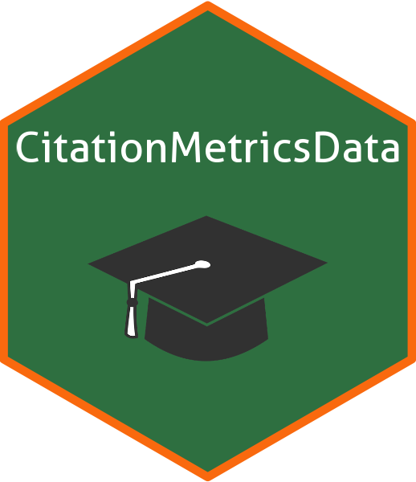

<!-- README.md is generated from README.Rmd. Please edit that file -->

```{r, include = FALSE}
knitr::opts_chunk$set(
  collapse = TRUE,
  comment = "#>",
  fig.path = "man/figures/README-",
  out.width = "100%"
)
```

# CitationMetricsData 

<!-- badges: start -->
<!-- badges: end -->

The goal of CitationMetricsData is to provide easy access to career-long and single-year citation data for top-cited scientists, based on the dataset 'August 2024 data-update for "Updated science-wide author databases of standardized citation indicators"' by Ioannidis, John P.A

## Installation

You can install the development version of CitationMetricsData from [GitHub](https://github.com/) with:

``` r
# install.packages("devtools")
devtools::install_github("thiyangt/CitationMetricsData")
```

```{r}
library(CitationMetricsData)
```

## Career-long data are updated to end-of-2023

```{r}
head(career.long.data)
```

##  Single recent year data pertain to citations received during calendar year 2023

```{r}
head(single.year.data)
```


## Data Source

Ioannidis, John P.A. (2024), “August 2024 data-update for "Updated science-wide author databases of standardized citation indicators"”, Elsevier Data Repository, V7, doi: 10.17632/btchxktzyw.7

Link: https://elsevier.digitalcommonsdata.com/datasets/btchxktzyw/7
