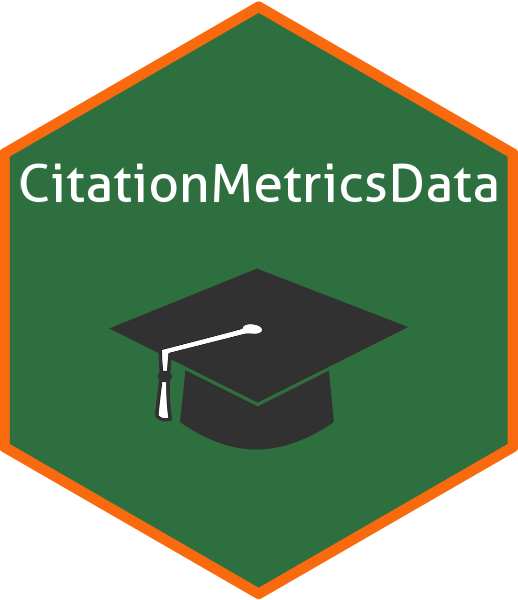
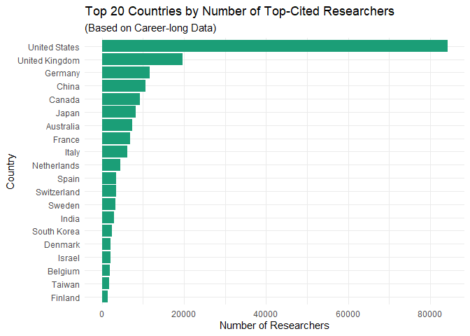
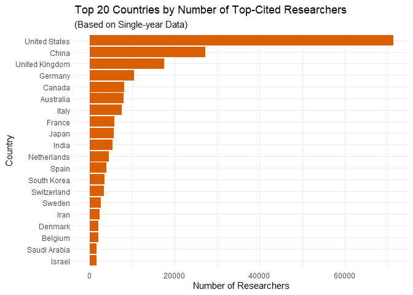

<!-- README.md is generated from README.Rmd. Please edit that file -->

# CitationMetricsData 

<!-- badges: start -->
<!-- badges: end -->

The goal of CitationMetricsData is to provide easy access to career-long
and single-year citation data for top-cited scientists, based on the
dataset ‘August 2024 data-update for “Updated science-wide author
databases of standardized citation indicators”’ by Ioannidis, John P.A

## Installation

You can install the development version of CitationMetricsData from
[GitHub](https://github.com/) with:

``` r
# install.packages("devtools")
devtools::install_github("thiyangt/CitationMetricsData")
```

``` r
library(CitationMetricsData)
```

## Career-long data are updated to end-of-2023

``` r
head(career.long.data)
#>             authfull                                 inst_name cntry np6023
#> 1  Graetzel, Michael  École Polytechnique Fédérale de Lausanne   che   1760
#> 2    Wang, Zhong Lin               Chinese Academy of Sciences   chn   2644
#> 3 Willett, Walter C. Harvard T.H. Chan School of Public Health   usa   2416
#> 4      Kresse, Georg                          Universität Wien   aut    388
#> 5 Kessler, Ronald C.                    Harvard Medical School   usa   1098
#> 6      Friston, Karl                 University College London   gbr   1270
#>   firstyr lastyr rank (ns) nc9623 (ns) h23 (ns) hm23 (ns) nps (ns) ncs (ns)
#> 1    1971   2024         1      365234      270 117.26972       59    29900
#> 2    1986   2025         2      279327      250 129.89991      115    20074
#> 3    1970   2024         3      346654      306 122.56186      123    12181
#> 4    1992   2024         4      297085      109  49.89060        6    59927
#> 5    1975   2024         5      267255      237  86.24892       39     6997
#> 6    1989   2024         6      188600      200 106.58298      100    19201
#>   cpsf (ns) ncsf (ns) npsfl (ns) ncsfl (ns)   c (ns) npciting (ns) cprat (ns)
#> 1        83     31616        943     237615 5.568907        139203   2.623751
#> 2       252     36304       1966     222143 5.528939        122780   2.275020
#> 3       238     35357        826     128419 5.482445        213707   1.622099
#> 4        31    259065        194     276531 5.460251        134682   2.205826
#> 5       236    126290        572     194376 5.435121        177155   1.508594
#> 6       240     69332        752     131617 5.427490        102244   1.844607
#>   np6023 cited9623 (ns)  self% rank nc9623 h23      hm23 nps   ncs cpsf   ncsf
#> 1                  1679 0.0692    2 392395 281 120.98197  59 30508   83  32280
#> 2                  2435 0.1475    1 327659 275 140.60115 115 22775  252  41009
#> 3                  2239 0.0917    3 381657 320 127.50385 123 12742  238  37917
#> 4                   375 0.0203    4 303251 117  51.70488   6 60117   31 260685
#> 5                  1061 0.0613    6 284705 249  89.94376  39  7088  236 131235
#> 6                  1157 0.1035    5 210372 215 114.74294 100 20296  240  75496
#>   npsfl  ncsfl        c npciting    cprat np6023 cited9623 np6023_rw
#> 1   943 252230 5.569447   142509 2.753475             1688         1
#> 2  1966 264116 5.580768   128016 2.559516             2461         0
#> 3   826 142359 5.496408   220721 1.729138             2253         0
#> 4   194 279757 5.460618   135764 2.233663              379         0
#> 5   572 204328 5.439991   181084 1.572226             1067         0
#> 6   752 146494 5.457504   105494 1.994161             1179         0
#>   nc9623_to_rw nc9623_rw                sm-subfield-1 sm-subfield-1-frac
#> 1            8       125 Nanoscience & Nanotechnology          0.2007964
#> 2            0       162 Nanoscience & Nanotechnology          0.5769522
#> 3            0       174                 Epidemiology          0.1896266
#> 4            0        34              Applied Physics          0.4201031
#> 5            0        69                   Psychiatry          0.5956284
#> 6            0        45     Neurology & Neurosurgery          0.5134281
#>             sm-subfield-2 sm-subfield-2-frac                          sm-field
#> 1        Chemical Physics         0.12343572 Enabling & Strategic Technologies
#> 2               Materials         0.10197119 Enabling & Strategic Technologies
#> 3   Nutrition & Dietetics         0.16431535                 Clinical Medicine
#> 4        Chemical Physics         0.25257732               Physics & Astronomy
#> 5           Public Health         0.05373406                 Clinical Medicine
#> 6 Experimental Psychology         0.11374408                 Clinical Medicine
#>   sm-field-frac rank sm-subfield-1 rank sm-subfield-1 (ns) sm-subfield-1 count
#> 1     0.4106940                  2                       1              135958
#> 2     0.7399545                  1                       2              135958
#> 3     0.5294606                  1                       1                9875
#> 4     0.8840206                  1                       1              304738
#> 5     0.7768670                  1                       1               80339
#> 6     0.6729858                  1                       1              341636
```

## Single recent year data pertain to citations received during calendar year 2023

``` r
head(single.year.data)
#>              authfull                    inst_name cntry np6023 firstyr lastyr
#> 1     Wang, Zhong Lin  Chinese Academy of Sciences   chn   2644    1986   2025
#> 2       Kresse, Georg             Universität Wien   aut    388    1992   2024
#> 3 Mirjalili, Seyedali Torrens University Australia   aus    539    2010   2024
#> 4     Bandura, Albert          Stanford University   usa    193    1953   2024
#> 5      BENGIO, YOSHUA       University of Montreal   can    556    1988   2024
#> 6      Grimme, Stefan             Universität Bonn   deu    688    1992   2024
#>   rank (ns) nc2323 (ns) h23 (ns) hm23 (ns) nps (ns) ncs (ns) cpsf (ns)
#> 1         1       37204       70  41.71970      115     1746       252
#> 2         2       31543       29  15.74862        6     6760        31
#> 3         3       21549       51  26.87937       21     2906        62
#> 4         4       10168       38  32.37778      105     8409       160
#> 5         5       49472       65  28.71259       12      607        83
#> 6         6       18244       35  23.75254       29     3575        83
#>   ncsf (ns) npsfl (ns) ncsfl (ns)   c (ns) npciting (ns) cprat (ns)
#> 1      2970       1966      30008 5.329884         12295   3.025946
#> 2     28515        194      29799 5.225850         15389   2.049711
#> 3     10352        288      15702 5.208715         10798   1.995647
#> 4      9593        179       9956 5.188626          7839   1.297104
#> 5      4484        376      28257 5.165211         40532   1.220566
#> 6     13553        335      17155 5.135912         12215   1.493573
#>   np6023 cited2323 (ns)  self% rank nc2323 h23     hm23 nps  ncs cpsf  ncsf
#> 1                  2122 0.1318    1  42850  78 45.96504 115 2045  252  3414
#> 2                   270 0.0067    3  31757  29 15.99862   6 6765   31 28536
#> 3                   450 0.0685    2  23134  53 28.86905  21 2974   62 10606
#> 4                   149 0.0022    4  10190  38 32.37778 105 8409  160  9603
#> 5                   422 0.0042    6  49682  65 28.99592  12  608   83  4494
#> 6                   476 0.0360    5  18925  38 24.45254  29 3604   83 13701
#>   npsfl ncsfl        c npciting    cprat np6023 cited2323 np6023_rw
#> 1  1966 34743 5.399672    12747 3.361575             2145         0
#> 2   194 29897 5.205248    15429 2.058267              278         0
#> 3   288 16511 5.220460    11082 2.087529              464         1
#> 4   179  9976 5.158580     7850 1.298089              149         0
#> 5   376 28379 5.137999    40620 1.223092              427         0
#> 6   335 17554 5.139399    12342 1.533382              505         0
#>   nc2323_to_rw nc2323_rw                              sm-subfield-1
#> 1            0         0               Nanoscience & Nanotechnology
#> 2            0         0                            Applied Physics
#> 3           32         4 Artificial Intelligence & Image Processing
#> 4            0         5                          Social Psychology
#> 5            0         2 Artificial Intelligence & Image Processing
#> 6            0         0                           Chemical Physics
#>   sm-subfield-1-frac                   sm-subfield-2 sm-subfield-2-frac
#> 1          0.5769522                       Materials         0.10197119
#> 2          0.4201031                Chemical Physics         0.25257732
#> 3          0.3929961 Networking & Telecommunications         0.07782101
#> 4          0.3214286             Clinical Psychology         0.13265306
#> 5          0.6654479         Experimental Psychology         0.13162706
#> 6          0.3473837               Organic Chemistry         0.32848837
#>                                   sm-field sm-field-frac rank sm-subfield-1
#> 1        Enabling & Strategic Technologies     0.7399545                  1
#> 2                      Physics & Astronomy     0.8840206                  1
#> 3 Information & Communication Technologies     0.6264591                  1
#> 4          Psychology & Cognitive Sciences     0.7091837                  1
#> 5 Information & Communication Technologies     0.7312614                  2
#> 6                                Chemistry     0.6235465                  1
#>   rank sm-subfield-1 (ns) sm-subfield-1 count
#> 1                       1              135958
#> 2                       1              304738
#> 3                       1              399064
#> 4                       1               24157
#> 5                       2              399064
#> 6                       1              106831
```

# Data Visualisations





## Data Source

Ioannidis, John P.A. (2024), “August 2024 data-update for”Updated
science-wide author databases of standardized citation indicators””,
Elsevier Data Repository, V7, doi: 10.17632/btchxktzyw.7

Link: <https://elsevier.digitalcommonsdata.com/datasets/btchxktzyw/7>
